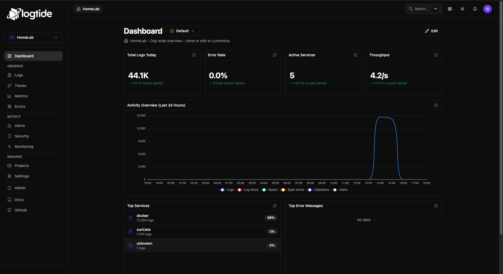
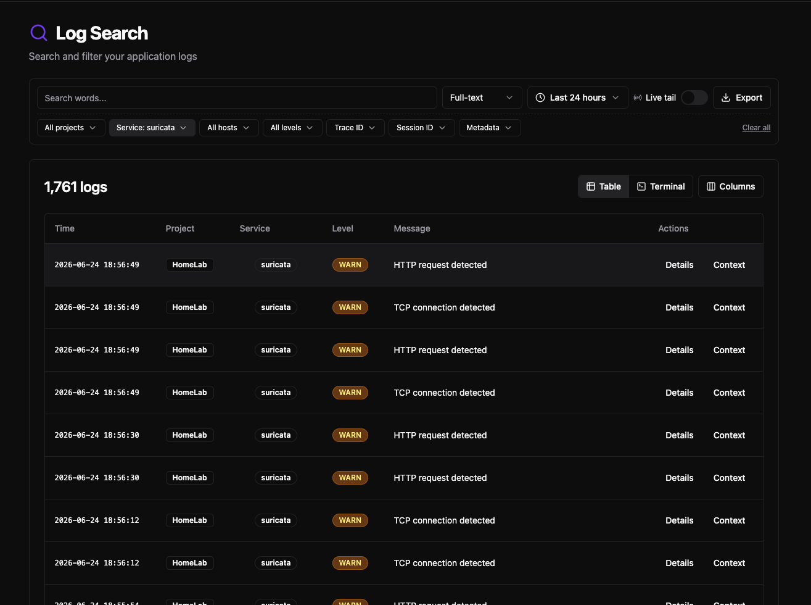
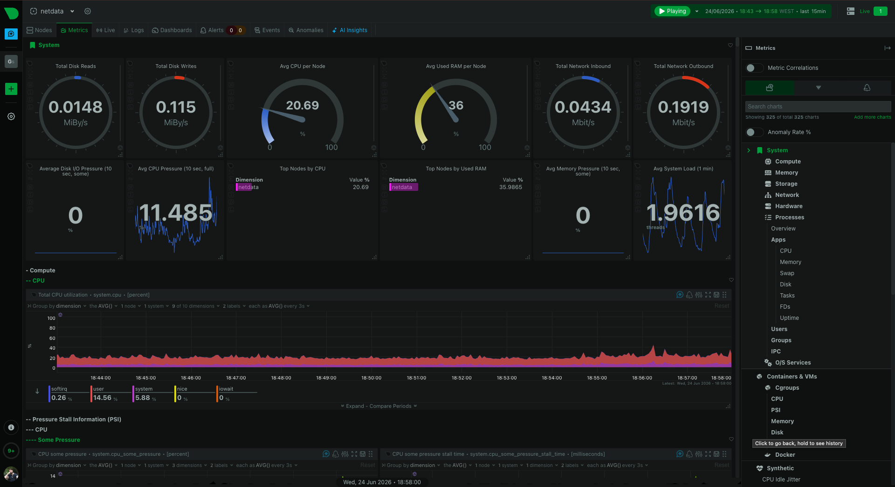
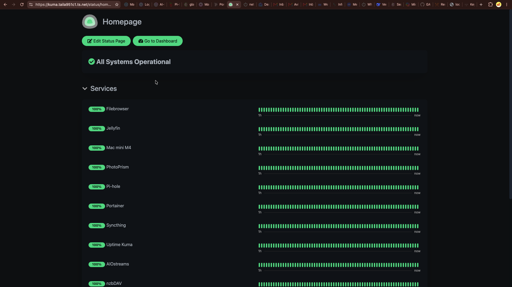
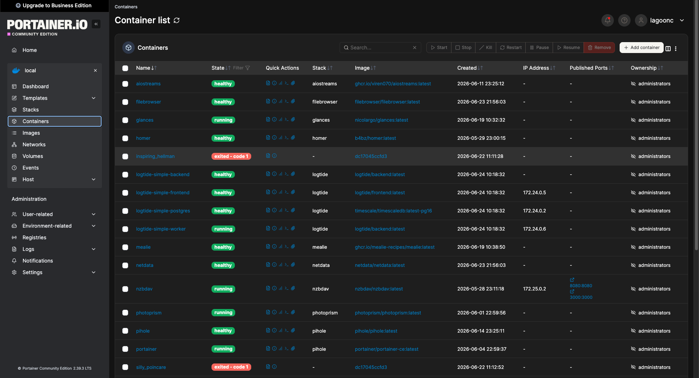
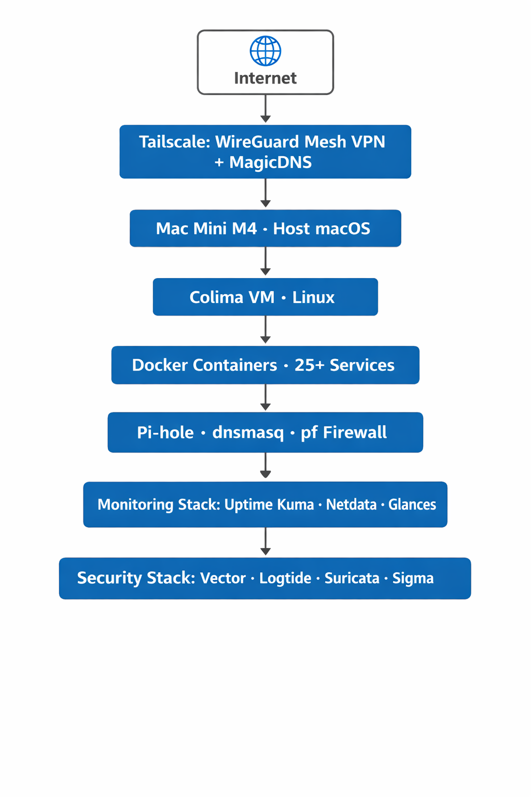

# 🖥️ Homelab – Mac Mini M4

Configuration and documentation of my 24/7 homelab running on **Mac Mini M4**, **Docker**, **Tailscale**, and a full **Security & Observability** stack.


> **🚀 Transitioning into Cybersecurity** • This homelab is my hands-on lab for mastering **network security**, **observability**, **log analysis**, and **infrastructure automation** — bridging the gap between theory and practice.

> **Objective:** Build a production-like environment to deepen hands-on experience in virtualization, containerization, network security, and observability — supporting my transition into **Cybersecurity**.

## 📋 Overview

This homelab runs 24/7 on an **Apple Mac Mini M4**, designed for:

- **Virtualization** via Colima (Linux VM on macOS)
- **Containerization** with Docker (25+ services)
- **Zero-Trust Networking** using Tailscale (WireGuard) — *0 exposed ports*
- **DNS & Routing** with Pi-hole, dnsmasq, and pf firewall
- **Monitoring & Observability** using Netdata, Uptime Kuma, and Glances
- **Security & Logging Stack** with Vector + Logtide + Suricata + Sigma Rules
- **Automation** with Bash scripts + Watchtower

> 📘 **Quick start:** see [docs/setup-guide.md](docs/setup-guide.md) for the full zero-to-running guide (physical network + containers).

## 🛠️ Hardware & Host Specifications

| Component | Specification |
| :--- | :--- |
| **Host Machine** | Apple Mac Mini M4 |
| **CPU (VM)** | 4 vCPUs allocated |
| **RAM (VM)** | 12 GB allocated |
| **Internal Storage** | macOS on internal SSD |
| **External Storage** | Crucial X9 1.82 TB · SanDisk 64 GB |
| **Host OS** | macOS Sonoma / Sequoia |
| **Guest OS** | Linux (via Colima) |

## 🐳 Core Docker Services (25+)

| Service | Purpose |
| :--- | :--- |
| **Pi-hole + Unbound** | DNS filtering + recursive DNS resolver |
| **Portainer** | Container management UI |
| **Uptime Kuma** | Uptime checks, push/email alerts |
| **Netdata** | Real-time metrics and dashboards |
| **PhotoPrism** | AI-powered photo management |
| **Glances** | Lightweight system monitoring |
| **AIOStreams** | Media stream aggregation |
| **Watchtower** | Automated container updates |
| **Caddy** | Reverse proxy with automatic HTTPS |
| **Vector** | Log collection, transformation, and routing |
| **Logtide** | Centralized logging platform + Sigma rule engine |
| **Suricata** | IDS/IPS (Intrusion Detection/Prevention System) |
| **Prometheus + Grafana** | Metrics collection and dashboards *(optional)* |
| **Vaultwarden** | Self-hosted password manager (Bitwarden compatible) |
| **Navidrome** | Personal music streaming server (Subsonic compatible) |
| *(+ supporting services)* | Tailscale sidecars, helpers, backups |

## 🔒 Network Architecture
```
Internet
└─ Vodafone (192.168.1.1) — modem + DMZ, Wi-Fi OFF
└─ Mercusys BE9300 (192.168.0.1) — NAT + Wi-Fi tri-band
└─ Mac Mini M4 (192.168.0.10)
├─ pf :53 → TCP 5355 (Docker) / UDP 9053 (dnsmasq)
├─ dnsmasq :9053 → Tailscale → Pi-hole + Unbound
└─ Colima VM → 25+ containers
```
> Details: [docs/network-migration-mercusys.md](docs/network-migration-mercusys.md) · Usenet: [docs/usenet-strategy.md](docs/usenet-strategy.md)

## 🔐 Key Security Highlights

- **Zero Exposed Ports:** No inbound ports are open to the public internet; all access is routed through Tailscale.
- **DNS Threat Prevention:** Pi-hole + Unbound block malicious domains and trackers.
- **Host Firewall:** `pf` enforces restrictive internal traffic rules.
- **Centralized Logging & Detection:** Logtide aggregates logs from all containers; Sigma rules detect threats in real time.
- **Network Intrusion Detection:** Suricata monitors traffic for malicious patterns, exploits, and C2 activity.
- **Automated Patching:** Watchtower keeps containers updated.
- **Audit & Forensics:** Structured logs with timestamps, metadata, and source/destination details are stored for investigation.

---

## 📈 Monitoring & Observability

| Tool | Purpose |
| :--- | :--- |
| **Uptime Kuma** | Uptime checks, status pages, alerts |
| **Netdata** | Real-time dashboards for CPU, RAM, I/O, network, containers |
| **Glances** | Lightweight system overview |
| **Logtide** | Centralized logging with full-text search, filtering, and live tail |
| **Suricata Alerts** | Integrated into Logtide for unified threat visibility |
| **Prometheus + Grafana** *(optional)* | Custom dashboards and metric aggregation |

---

## 📸 Dashboard Previews

### Logtide – Centralized Logging


### Suricata Alerts integrated into Logtide


### Netdata – System Metrics


### Uptime Kuma – Status Page


### Portainer – Container Management


### Architecture Diagram


---

## 📂 Repository Structure

> The full repository structure is available in the project tree. Key directories include `services/` (each service isolated with its own `docker-compose.yml`), `scripts/`, `configs/` and `docs/`. All secrets are managed via environment variables.

```text
/
├── README.md
├── .env.example
├── .gitignore
├── services/
│   ├── aiostreams/
│   │   └── docker-compose.yml
│   ├── filebrowser/
│   │   └── docker-compose.yml
│   ├── glances/
│   │   └── docker-compose.yml
│   ├── homer/
│   │   └── docker-compose.yml
│   ├── logtide/
│   │   ├── docker-compose.simple.yml
│   │   └── vector/vector.toml
│   ├── netdata/
│   │   └── docker-compose.yml
│   ├── nzbdav/
│   │   └── docker-compose.yml
│   ├── photoprism/
│   │   └── docker-compose.yml
│   ├── pihole/
│   │   └── docker-compose.yml
│   ├── suricata/
│   │   ├── docker-compose.suricata.yml
│   │   ├── suricata.yaml
│   │   └── rules/local.rules
│   └── uptime-kuma/
│       └── docker-compose.yml
├── network/
│   ├── pf.anchors/
│   │   └── pihole
│   └── dnsmasq.conf
├── configs/
│   ├── homer/
│   │   └── config.yml
│   └── (other config files)
├── scripts/
│   ├── backup.sh
│   ├── health-check.sh
│   └── update-all.sh
├── screenshots/
│   └── (screenshots)
├── asset/
│   └── architecture-diagram.png
└── docs/
    ├── setup-guide.md
    ├── network-migration-mercusys.md
    └── usenet-strategy.md
```

> **Service Isolation:** Each service runs in its own directory with a dedicated `docker-compose.yml`. All secrets are managed via environment variables (see `.env.example`).

---

## 🎯 Key Learnings & Takeaways

- **Virtualization on Apple Silicon:** provisioning and tuning Linux VMs
- **Zero-Trust Networking:** replacing port‑forwarding with secure VPN overlays
- **Layered Observability:** combining uptime checks, metrics, and lightweight monitoring
- **Infrastructure as Code:** reproducible deployments with Docker Compose and scripts
- **Operational Troubleshooting:** resolving DNS conflicts, resource contention, and service dependencies
- **Security Operations:** implementing SIEM‑like capabilities with Logtide + Sigma, and network‑level detection with Suricata
- **Incident Response:** simulating attacks and validating detections in a controlled environment

---

## 📌 About This Project

This homelab is a cornerstone of my transition into **Cybersecurity**. It bridges theory and practice by providing a controlled environment to experiment with secure architectures, monitoring, automation, and incident response while simulating real operational constraints.

Feedback, suggestions, and collaboration are welcome.

---

## ✅ Completed Roadmap (Security‑Focused)

- [x] **Centralized Logging Platform** – Logtide with Vector for log collection, transformation, and routing
- [x] **Sigma Rule Engine** – Threat detection integrated into Logtide
- [x] **IDS/IPS (Suricata)** – Network intrusion detection with custom local rules
- [x] **Monitoring & Metrics** – Netdata, Uptime Kuma, and Glances
- [x] **Integration of Suricata alerts into Logtide** – Unified visibility via Vector
- [x] **Tailscale for secure remote access** – Zero‑trust networking with no exposed ports

---

## 🔗 Connect & Collaborate

- **Personal Site:** [gasm14.github.io](https://gasm14.github.io) ← **most up-to-date**
- **LinkedIn:** [linkedin.com/in/gonçalo-marçalo-57a996190](https://www.linkedin.com/in/gonçalo-marçalo-57a996190)
- **Email:** [gonsaloam@outlook.pt](mailto:gonsaloam@outlook.pt)
- **Job Radar (open-source):** [github.com/GASM14/Job-Radar](https://github.com/GASM14/Job-Radar)

> 💼 **Looking for a CV in PDF?** Contact me at [gonsaloam@outlook.pt](mailto:gonsaloam@outlook.pt) and I'll send the latest version.
